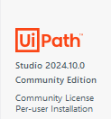
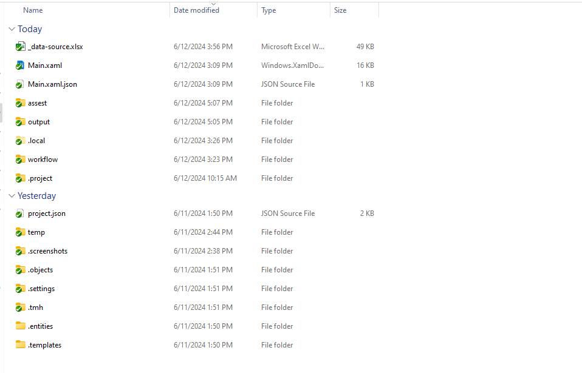
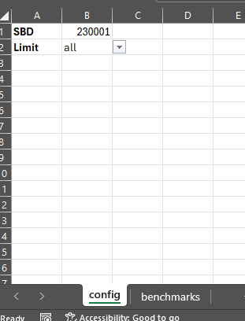
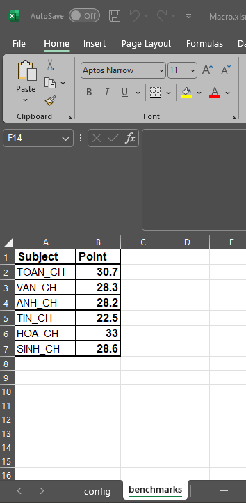
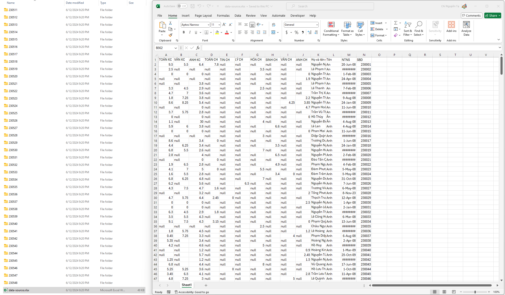
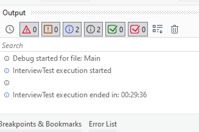

# BOT lấy dữ liệu điểm thi học sinh và tạo báo cáo.

Link web

```
https://lookerstudio.google.com/u/0/reporting/6a99f06c-f0a9-4aa8-8d68-058b1afdb6a5/page/cOHMD?s=pKnsq0u7hHc
```

[Yêu cầu đề bài](/docs//Requirements_update.pdf)

# Phần 1: Cài đặt môi trường

- Phiên bản Bot được phát triển ở phiên bản UiPath 2024.10.0



- Máy tính cần cài đặt Uipath, Google chrome, và Microsoft Office Excel.
- Nếu máy tính bạn chưa có Uipath có thể cài đặt tại đây. https://drive.google.com/drive/folders/1jj791B2Bs0fqx7Ywiw5RXewb2KWNTgKp?usp=sharing. Sau khi cài đặt xong cập nhật lên phiên bản mới nhất

# Phần 2: Cấu trúc thư mục

Một số thư mục và file quan trọng


## 1 _Main.xaml_ file mở Project Bot

## 2 _assest_ là thư mục chứa macro xữ lý report và template report

- _Macro.xlsm_ là file chứa macro và cấu hình:

- bạn có thể thay đổi config **all** thành **5** để giới hạn số lượng dữ liệu lấy về

  

- Cấu hình bảng benchmarks

  

## 3 _output_ là thư mục file đầu ra

- data-source.xlsx chứa nội dung dữ liệu
- Các thư mục còn lại tương ứng số báo danh từng thí sinh
  

# Phần 3: Thời gian thực thi

- Tuỳ điều kiện cấu hình máy tính thời gian thực thi sẽ khác nhau.
- Test thực tế trên máy tính laptop cá nhân bao gồm việc lấy dữ liệu của hơn 500 thí sinh và xuất report là hơn 30p (thời gian thực thi này chỉ tham khảo)
  
  

# Phần 4: Các lưu ý khi chạy bot
- Cài extension Uipath cho google chrome.
- Đóng hết các cửa sổ trình duyệt và excel
- Bên trong thư mục **output** phải rổng
- Trong lúc chạy bot không thao tác với máy tính
- Khi nhập xong đến page cuối, có một khoảng thời gian thấy bot đứng yên, lúc đó bot đang xuất report.

# Phần 5: Một vài trường hợp của report kết quả

- Trường hợp thiếu thông tin

  Thí sinh **230548**

- Trường hợp pass

  Thí sinh **230001**, **230009**

- Trường hợp đủ thông tin nhưng fail

  Thí sinh **230003**

- Trường hợp vừa pass môn này, vừa fail môn kia

  Thí sinh **230393**
