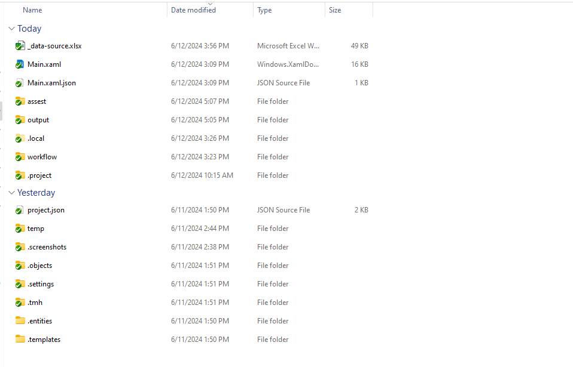

# BOT lấy dữ liệu điểm thi học sinh và tạo báo cáo.

Link web

```
https://lookerstudio.google.com/u/0/reporting/6a99f06c-f0a9-4aa8-8d68-058b1afdb6a5/page/cOHMD?s=pKnsq0u7hHc
```

# Phần 1: Cài đặt môi trường

## 1 Cài đặt môi trường

- Phiên bản Bot được phát triển ở phiên bản 2024.10.0


- Máy tính cần cài đặt Uipath, Google chrome, và Microsoft Office Excel.

## 2 Cấu trúc thư mục

Một số thư mục và file quan trọng


- **Main.xaml** file mở Project Bot
- **output** là thư mục file đầu ra
- **assest** là thư mục chứa macro xữ lý report và template report
- **Macro.xlsm** là file chứa macro và cấu hình:

* bạn có thể thay đổi config **all** thành **5** để giới hạn số lượng dữ liệu lấy về

  
* Cấu hình benchmarks

  
